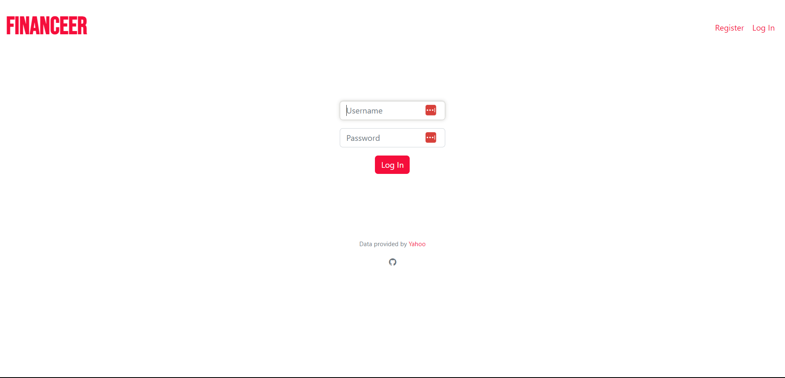
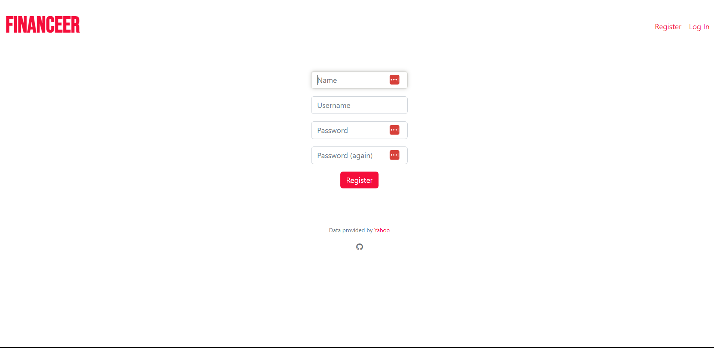
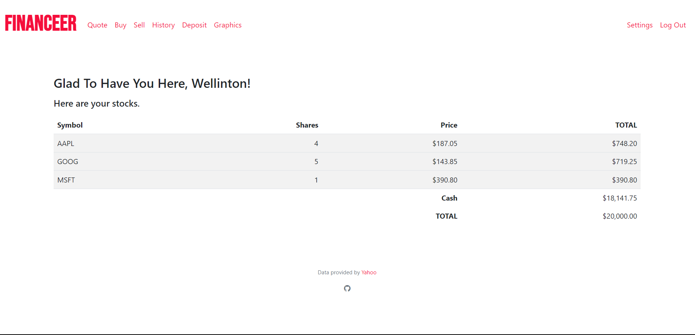
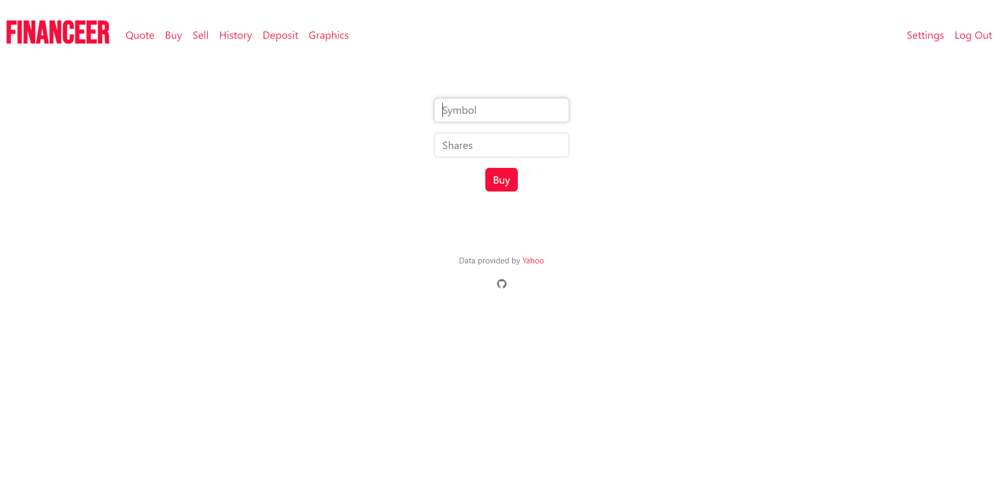
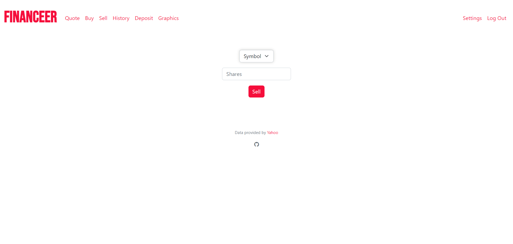
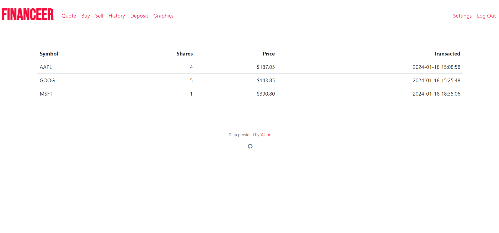
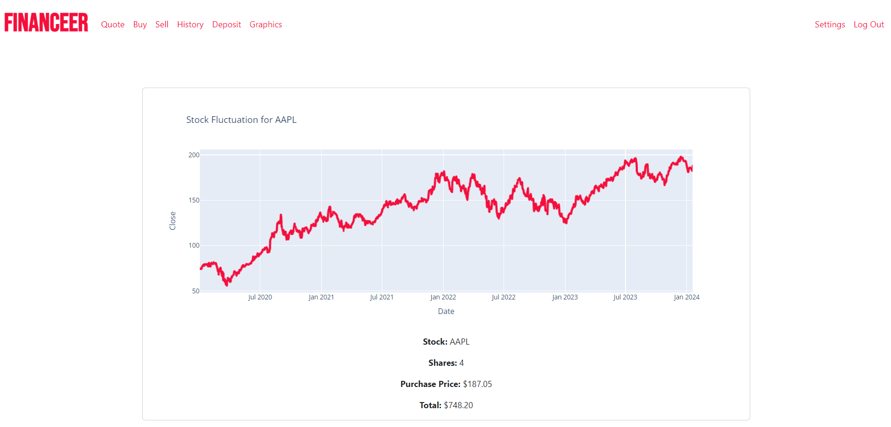
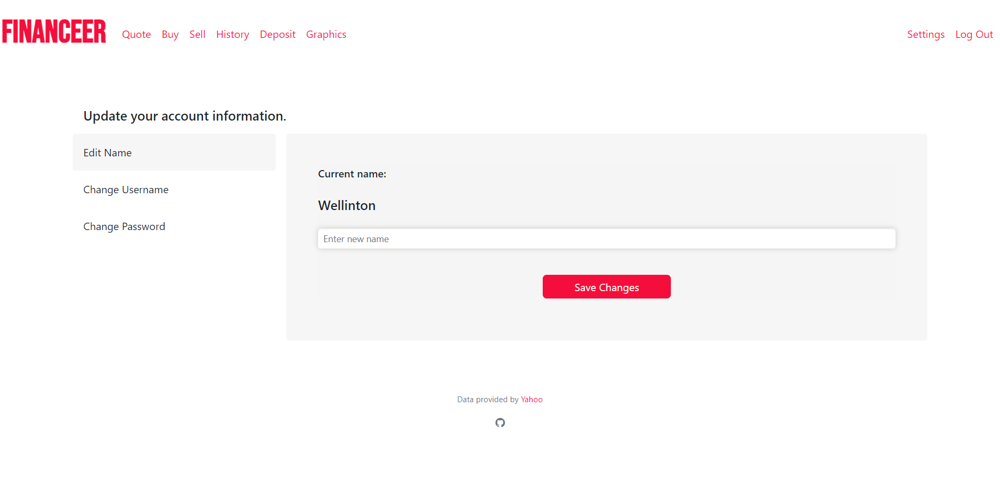
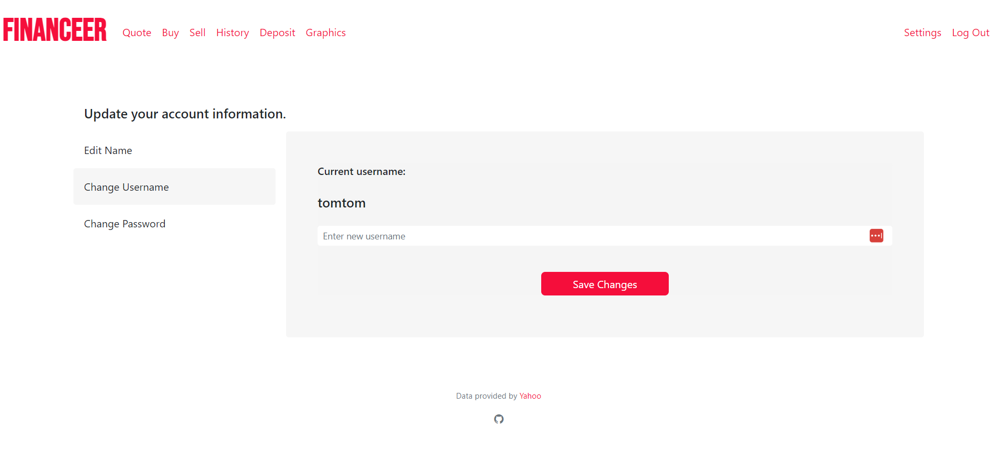
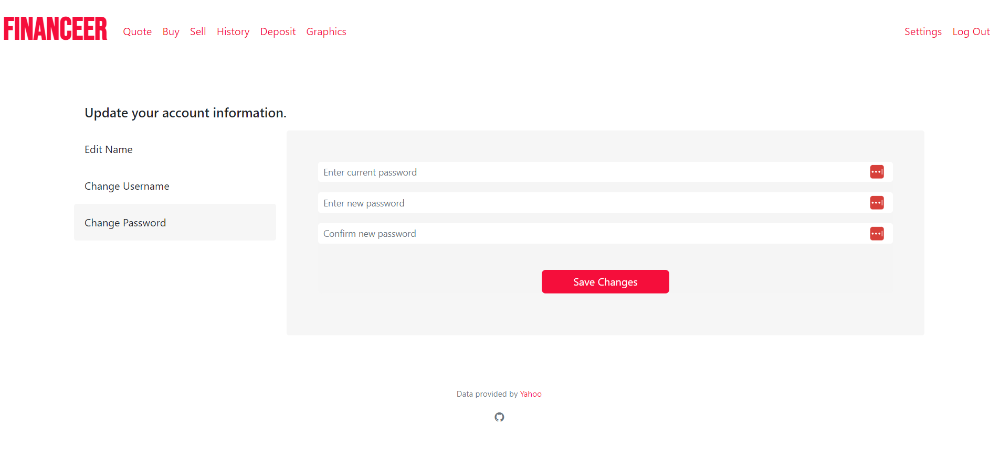

### [Video Demo](https://www.youtube.com/watch?v=O3EnhRa78LA)

### Description:
Financeer is an enhancement of Problem Set 9 'CS50 Finance'. The visuals have been improved, there are new features, and a fresh look.

# Deployment:

### 

# Technologies:

- Flask
- Python
- Plotly
- SQLite
- Javascript
- HTML
- CSS
- Bootstrap 5

# Installation:

- Clone / fork this repository.
- Create a virtual enviroment for your local financeer directory.
- Install the required libraries that are listed in [requirements.txt](requirements.txt).
- Run the application:

```
$ python run.py
```
- Enjoy ;)

# Features:

## Login / Register page:




Users have to create an account prior to using this application. Validation is implemented both in front end and back end. Users have to provide a name, a minimum of four-alphanumeric-characters username that will be used to identify which user has logged in, and a password. The password in the database is hashed first, bur for safety measures.

## Index:



On this page, all stocks purchased by the user will be organized and displayed in a table, sorting each stock alphabetically.

## Quote:



On the Quote, users will be able to check the trading price of a stock.

## Buy / Sell Page:




On both the Buy Page and the Sell Page, users can 'interact' with the desired stock, either by buying or selling the shares (if they have any, of course). Each new registered user receives a minimum value of $10,000.00.

## History:



On the History, we display all transactions made by the user, along with the timestamp of when they occurred.

## Graphics:



On the Graphics, the user will be able to have a graphical representation of the stocks they own in their portfolio. They will be able to obtain a visual overview of the stock's performance over the last 4 years.

## Settings:



Users can change name, username, and password in this page. Validation is implemented in back end. Vertical tab tutorial can be found [here](https://github.com/tromgy/bootstrap-5-vertical-tabs).

- ### Name


Users are free to choose any name. The chosen name will be displayed on the index page to greet the users.


- ### Username



Username should contain at least four alphanumeric characters. Username is unique and used to identify which user has logged in.

- ### Password



Password should be a minimum of eight alphanumeric characters and should not contain trailing spaces.
